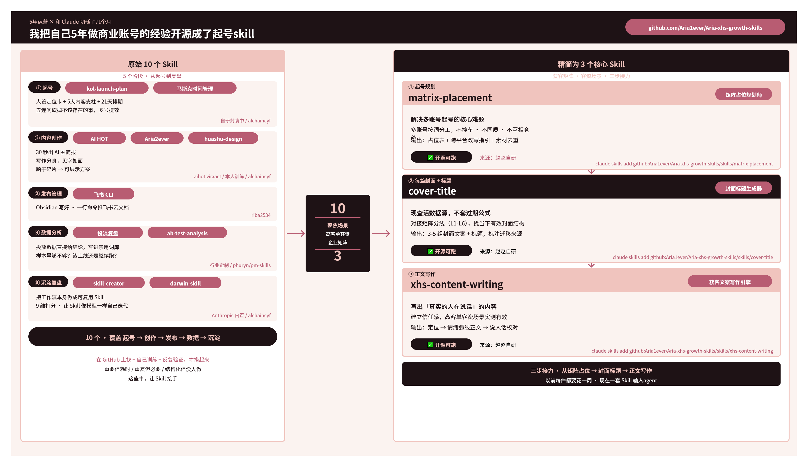
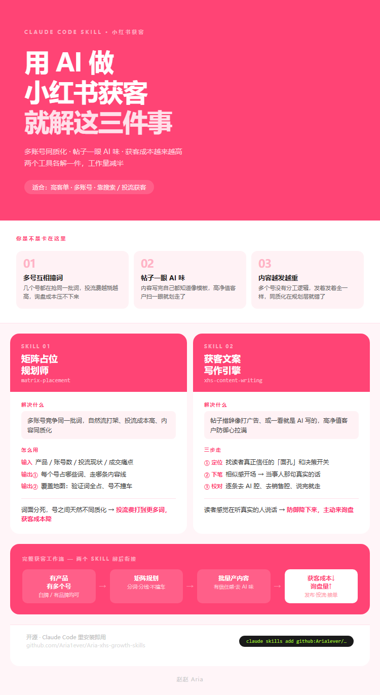

# 我把自己 5 年做商业账号的经验开源成了起号 Skill

> 5 年运营 × 和 Claude 切磋了几个月





---

## 原始 10 个 Skill · 5 个阶段，从起号到复盘

| 阶段 | Skill | 做什么 | 来源 |
|---|---|---|---|
| ① 起号 | kol-launch-plan | 人设定位卡 + 5 大内容支柱 + 21 天排期 | 自研封装中 |
| ① 起号 | 马斯克时间管理 | 五连问收掉不该存在的事，多号提效 | alchaincyf |
| ② 内容创作 | AI HOT | 30 秒出 AI 圈简报 | aihot.virxact |
| ② 内容创作 | Aria2ever | 写作分身，见字如面 | 本人训练 |
| ② 内容创作 | huashu-design | 脑子碎片 → 可展示方案 | alchaincyf |
| ③ 发布管理 | 飞书 CLI | Obsidian 写好，一行命令推飞书云文档 | riba2534 |
| ④ 数据分析 | 投流复盘 | 投放数据直接给结论，写进禁用词库 | 行业定制 |
| ④ 数据分析 | ab-test-analysis | 样本量够不够？该上线还是继续跑？ | phuryn/pm-skills |
| ⑤ 沉淀复盘 | skill-creator | 把工作流本身做成可复用 Skill | Anthropic 内置 |
| ⑤ 沉淀复盘 | darwin-skill | 9 维打分，让 Skill 像模型一样自己迭代 | alchaincyf |

在 GitHub 上线 + 自己训练 + 反复验证，才搭起来。  
重要但耗时 / 重复但必要 / 结构化但没人做——这些事，让 Skill 接手。

---

## 精简为 3 个核心 Skill · 聚焦高客单客资场景

**获客矩阵 · 客资管理 · 三步接力**

---

### ① 起号规划 · `matrix-placement` · 矩阵占位规划师

解决多账号起号的核心难题：  
多账号按词分工，不撞车 · 不同质 · 不互重叠  
输出：占位表 + 跨平台改写指引 + 素材去重

✅ 开源可跑 · 来源：赵赵自研

```bash
claude skills add github:Aria1ever/Aria-xhs-growth-skills/skills/matrix-placement
```

---

### ② 每篇封面 + 标题 · `cover-title` · 封面标题生成器

现查活数据源，不套过期公式  
对接矩阵分线（L1-L6），找当下有效封面结构  
输出：3-5 组封面文案 + 标题，标注迁移来源

✅ 开源可跑 · 来源：赵赵自研

```bash
claude skills add github:Aria1ever/Aria-xhs-growth-skills/skills/cover-title
```

---

### ③ 正文写作 · `xhs-content-writing` · 获客文案写作引擎

写出「真实的人在说话」的内容  
建立信任感，高客单客资场景实测有效  
输出：定位 → 情绪弧线正文 → 说人话校对

✅ 开源可跑 · 来源：赵赵自研

```bash
claude skills add github:Aria1ever/Aria-xhs-growth-skills/skills/xhs-content-writing
```

---

**三步接力：从矩阵占位 → 封面标题 → 正文写作**  
以前每件都要花一周 · 现在一套 Skill 输入 agent

---

📎 交流更多：


_作者：赵赵 Aria_
